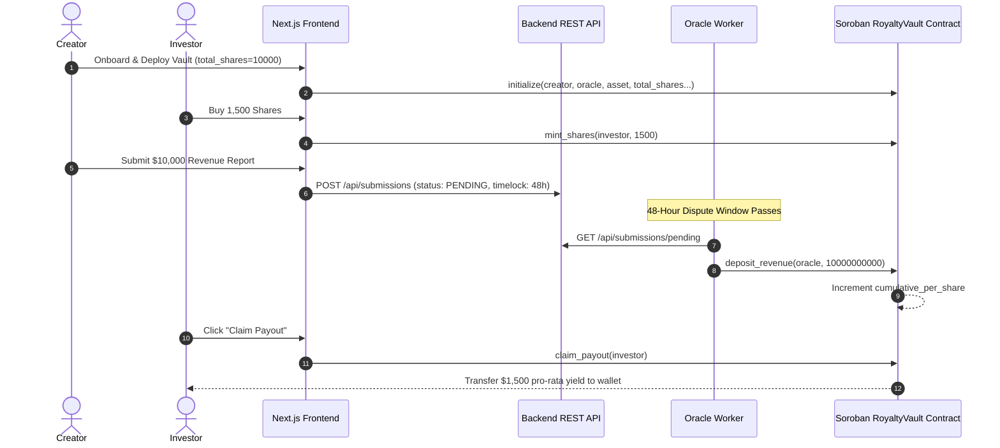

# System Architecture Specification 📐

## Overview

RoyalStream is structured as a TurboRepo monorepo built for high performance, modularity, and strict separation of concerns across smart contracts, off-chain services, and web applications.

```
+-----------------------------------------------------------------------------------+
|                                 MONOREPO LAYOUT                                   |
+-----------------------------------------------------------------------------------+
|                                                                                   |
|  APPS                                                                             |
|  ├── apps/frontend          # Next.js 15 App Router (Marketplace & Dashboard)   |
|  ├── apps/backend-api       # Express + Prisma REST API (Off-chain metadata)     |
|  └── apps/oracle-worker     # Revenue Ingestion Cron & 48h Timelock Worker       |
|                                                                                   |
|  PACKAGES                                                                         |
|  ├── packages/stellar-sdk   # Soroban RPC Client & Freighter Wallet Driver       |
|  ├── packages/types         # Shared TypeScript Types & Interfaces                |
|  └── packages/ui            # Shared React UI Components                         |
|                                                                                   |
|  SOROBAN CONTRACTS                                                                |
|  └── soroban-contracts/     # Rust Soroban Smart Contracts (`royalty_vault`)     |
|       └── royalty-vault/                                                          |
|                                                                                   |
+-----------------------------------------------------------------------------------+
```

---

## Component Responsibilities & Boundaries

### 1. Smart Contract Boundary (`soroban-contracts/royalty-vault`)
- Handles on-chain state, share minting, pro-rata revenue deposits, payout claims, and secondary share transfers.
- **Rule**: Pure Rust `#![no_std]` binary compiling to `wasm32-unknown-unknown`. Holds zero reliance on off-chain web frameworks.

### 2. Shared SDK Boundary (`packages/stellar-sdk`)
- Serves as the single point of contact between application code and on-chain RPC calls.
- Encapsulates wallet connection drivers (`Freighter`, `Lobstr`) and `RoyaltyVaultClient` Soroban contract invocation wrappers.
- **Rule**: Frontend and backend workers must call Soroban through `@royalstream/stellar-sdk` rather than instantiating raw RPC calls directly in UI pages.

### 3. Off-Chain Metadata API Boundary (`apps/backend-api`)
- Manages off-chain metadata (creator biography, stream descriptions, promotional graphics, cached historical payouts, and pending dispute records).
- **Rule**: Does not store or control private key signers for contract admin actions.

### 4. Oracle Worker Boundary (`apps/oracle-worker`)
- Periodically executes revenue ingestion checks via `RevenueSourceAdapter` instances (`ManualSubmissionSource`, `SpotifyRevenueSource`, `DistroKidRevenueSource`).
- Enforces the 48-hour dispute timelock prior to submitting `deposit_revenue` transactions to Soroban.

### 5. Web Frontend Boundary (`apps/frontend`)
- Consumes `@royalstream/ui`, `@royalstream/stellar-sdk`, and `@royalstream/types`.
- Manages active wallet connection state, vault browsing, revenue submission forms, and payout claim actions via Zustand.

---

## Revenue Lifecycle Sequence Diagram


